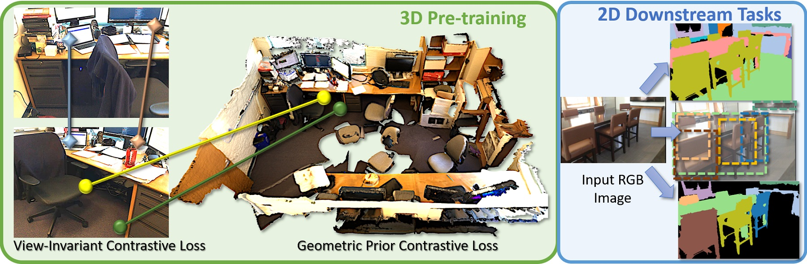

# Pri3D: Can 3D Priors Help 2D Representation Learning? [ICCV 2021]



Pri3D leverages 3D priors for downstream 2D image understanding tasks: during pre-training, we incorporate view-invariant and geometric priors from color-geometry information given by RGB-D datasets, imbuing geometric priors into learned features. We show that these 3D-imbued learned features can effectively transfer to improved performance on 2D tasks such as semantic segmentation, object detection, and instance segmentation.

[[ICCV 2021 Paper]](https://arxiv.org/pdf/2104.11225.pdf) [[Video]](https://www.youtube.com/watch?v=S2VodtyfQbQ)

## Environment
This codebase was tested with the following environment configurations.
- Ubuntu 20.04
- CUDA 11.2
- GCC 7.3.0
- Python 3.8.8
- PyTorch 1.7.1
- [COLMAP](https://colmap.github.io) v3.7
- [MinkowskiEngine](https://github.com/stanfordvl/MinkowskiEngine) v0.5.1
- [Detectron2](https://detectron2.readthedocs.io/en/latest/tutorials/install.html) v0.5


## Installation

We use conda for the installation process:
```
# Install virtual env and PyTorch
conda create -n sparseconv051 python=3.8
conda activate sparseconv051
conda install pytorch==1.7.1 torchvision==0.8.2 cudatoolkit=11.0 -c pytorch

# Complie and install MinkowskiEngine 0.5.1.
conda install mkl mkl-include -c intel
wget https://github.com/NVIDIA/MinkowskiEngine/archive/refs/tags/v0.5.1.zip
cd MinkowskiEngine-0.5.1 
python setup.py install
```

Next, clone the Pri3D repository and install the requirement from the root directory.

```
git clone https://github.com/Sekunde/Pri3D.git
cd Pri3D
pip install -r requirements.txt
```
Training Mask R-CNN models requires [Detectron2](https://detectron2.readthedocs.io/en/latest/tutorials/install.html).

[Logging] Pri3D will create runs for logging training curves and configurations in the project named *pri3d* in [Weights & Biases](https://wandb.ai/home). Additionally, checkpoints and a txt log file will be stored in the specified output folder. You will be asked to input username and password of Weights & Biases in the first time to run the training code.

[Optional] If you want to pre-train the view-consistent contrastive loss on MegaDepth data, you need to install [COLMAP](https://colmap.github.io), see their installation ducomentation.


## Pre-training Section
### Data Pre-processing
#### Prepare ScanNet Pre-training Data

For pre-training view-invariant contrastive loss, **pairs of ScanNet frames data** can be generated by the following code (need to change the TARGET and SCANNET_DIR accordingly in the script). This piece of code first extracts pointcloud from partial frames, and then computes a filelist of overlapped partial frames for each scene.

```
cd pretrain/data_preprocess/scannet
./preprocess.sh
```
 
Then a combined txt file called *overlap30.txt* of filelists of each scene can be generated by running the following code. This *overlap30.txt* should be put into folder *TARGET/splits*.

```
cd pretrain/data_preprocess/scannet
python generate_list.py --target_dir TARGET
```

For pre-training geometric-prior, we first generate **point cloud of ScanNet reconstruction**. This can be done by running following code. We use SCANNET_DATA to refer where scannet data lives and SCANNET_OUT_PATH to denote the output path of processed scannet data.

```
# Edit path variables: SCANNET_DATA and SCANNET_OUT_PATH
cd pretrain/data_preprocess/scannet
python collect_indoor3d_data.py --input SCANNET_DATA --output SCANNET_OUT_PATH
# copy the filelists
cp -r split SCANNET_OUT_PATH
```

Afterwards, we further generate **chunk bbox** that is used for cropping chunks by running following code. TARGET points to where the previously generated pairs of ScanNet frames are located.
```
cd pretrain/data_preprocess/scannet/
python chunk.py --base TARGET
```

#### Prepare MegaDepth Pre-training Data
We borrow the MegaDepth data generation code from [D2-Net](https://github.com/mihaidusmanu/d2-net). After installing [COLMAP](https://colmap.github.io) and downloading the [MegaDepth Dataset](http://www.cs.cornell.edu/projects/megadepth/)(including SfM models), you can run the following code to pre-process data.
```
cd pretrain/data_preprocess/megadepth/
python undistort_reconstructions.py --colmap_path /path/to/colmap/executable --base_path /path/to/megadepth
bash preprocess_undistorted_megadepth.sh /path/to/megadepth /path/to/output/folder
```
We also provide [visualization](pretrain/data_preprocess/megadepth/megadepth_visualization.ipynb) of the MegaDepth data.

#### Prepare KITTI Pre-training Data
Download [KITTI Dataset](http://www.cvlibs.net/datasets/kitti/index.php) and run the following code to pre-process the data. This will create an **overlap.txt** file indexing the pairs of frames as well as a **mapping folder** storing the coordinates mapping between frames located in /path/to/kitti/dataset.
```
cd pretrain/data_preprocess/kitti/
python kitti_process.py --input /path/to/kitti/dataset
```

### Pre-training on Different Datasets
To pre-train on different datasets, we provide the scripts to train Pri3D with 8 GPUs (batch_size=64, 8 per GPU) on a single server under folder **pretrain/pri3d/scripts**. Pri3D can also be pre-trained on the server with fewer GPUs, e.g. 4 GPUs by setting train.batsh_size=32 (8 per GPUs) and optimizer.accumulate_step=2 (effective batch_size=32x2=64) to accumulate gradients. The code is competitable with [facebook hydra](https://hydra.cc). Our codebase enables multi-gpu training with distributed data parallel (DDP) module in pytorch.

#### Pre-train on ScanNet

TARGET and SCANNET_OUT_PATH refer to the pre-processed data locations that are defined in [Prepare ScanNet Pre-train Data](#Prepare-ScanNet-Pre-training-Data).

```
cd pretrain/pri3d
export DATAPATH=TARGET 
# if pre-train with geometric-contrastive loss
export POINTCLOUD_PATH=SCANNET_OUT_PATH
# Pretrain with view-invariant loss (ResNet50 backbone)
LOG_DIR=/path/to/log/folder BACKBONE=Res50UNet VIEW=True scripts/scannet.sh
# Pretrain with geometric-contrastive loss (ResNet50 backbone)
LOG_DIR=/path/to/log/folder BACKBONE=Res50UNet GEO=True scripts/scannet.sh
# Pretrain with view-invariant and geometric-contrastive loss (ResNet50 backbone)
LOG_DIR=/path/to/log/folder BACKBONE=Res50UNet VIEW=True GEO=True scripts/scannet.sh
# Pretrain with view-invariant loss (ResNet18 backbone)
LOG_DIR=/path/to/log/folder BACKBONE=Res18UNet VIEW=True scripts/scannet.sh
```

#### Pre-train on MegaDepth
```
cd pretrain/pri3d
export DATAPATH=/path/to/megadepth/processed/data/folder
# Pretrain with view-invariant loss (ResNet50 backbone)
LOG_DIR=/path/to/log/folder BACKBONE=Res50UNet scripts/megadepth.sh
# Pretrain with view-invariant loss (ResNet18 backbone)
LOG_DIR=/path/to/log/folder BACKBONE=Res18UNet scripts/megadepth.sh
```
#### Pre-train on KITTI

```
cd pretrain/pri3d
export DATAPATH=KITTI_PATH
# Pretrain with view-invariant loss (ResNet50 backbone)
LOG_DIR=/path/to/log/folder BACKBONE=Res50UNet scripts/kitti.sh
# Pretrain with view-invariant loss (ResNet18 backbone)
LOG_DIR=/path/to/log/folder BACKBONE=Res18UNet scripts/kitti.sh
```

## Downstream Task Section

### Semantic Segmentation on ScanNet
Download [scannet_frames_25k](http://kaldir.vc.in.tum.de/scannet_benchmark/documentation#data) and unzip to SCANNET_SEMSEG. It should have following structures.

```
SCANNET_SEMSEG/
    scene0000_00/
        color/
	depth/
	instance/
	label/
	pose/
	intrinsics_color.txt
	intrinsics_depth.txt
    scene0000_01/
    ...
```

Export path SCANNET_SEMSEG to enviromental variable $DATAPATH and run the code to train the ResUNet models.

```
cd downstream/semseg/unet
export DATAPATH=SCANNET_SEMSEG
export PHASE=train
# train the model with ResNet50 backbone, initialized with ImageNet pre-trained model
LOG_DIR=/path/to/log/folder BACKBONE=Res50UNet INIT=imagenet scripts/scannet.sh
# train the model with ResNet50 backbone, train from scratch 
LOG_DIR=/path/to/log/folder BACKBONE=Res50UNet INIT=scratch scripts/scannet.sh
# train the model with ResNet50 backbone, train from scratch with 20% data.
LOG_DIR=/path/to/log/folder BACKBONE=Res50UNet INIT=scratch PHASE=train20 scripts/scannet.sh
# train the model with ResNet50 backbone, initialized with specified pre-trained model
LOG_DIR=/path/to/log/folder BACKBONE=Res50UNet INIT=/path/to/saved/model scripts/scannet.sh
# train the model with ResNet18 backbone, initialized with ImageNet pre-trained model
LOG_DIR=/path/to/log/folder BACKBONE=Res18UNet INIT=imagenet scripts/scannet.sh
```

Similarly, export environmental variable and run the code to train PSPNet and DeepLabV3/V3+ models.

```
# train PSPNet (ResNet50 as backbones)
cd downstream/semseg/pspnet
export DATAPATH=SCANNET_SEMSEG
# train PSPNet with ResNet50 backbone, initialized with ImageNet pre-trained model
LOG_DIR=/path/to/log/folder INIT=imagenet scripts/scannet.sh
# train PSPNet with ResNet50 backbone, initialized with specified pre-trained model
LOG_DIR=/path/to/log/folder INIT=/path/to/checkpoint scripts/scannet.sh

# train DeepLabV3 and DeepLabV3+ models (ResNet50 as backbones)
cd downstream/semseg/deeblabv3
export DATAPATH=SCANNET_SEMSEG
# train DeepLabV3 with ResNet50 backbone, initialized with ImageNet pre-trained model
LOG_DIR=/path/to/log/folder INIT=imagenet scripts/train_scannet_deeplapv3.sh
# train DeepLabV3+ with ResNet50 backbone, initialized with ImageNet pre-trained model
LOG_DIR=/path/to/log/folder INIT=imagenet scripts/train_scannet_deeplapv3plus.sh
# train DeepLabV3+ with ResNet50 backbone, initialized with specified pre-trained model
LOG_DIR=/path/to/log/folder INIT=/path/to/checkpoint scripts/train_scannet_deeplabv3plus.sh
```

#### Model Zoo
PSPNet and DeepLabV3/V3+ use checkpoints in torchvision format, thus we provide the code for converting from our Pri3D pre-trained checkpoint to torchvision checkpoint.
```
cd downstream/conversion
python pri3d_to_torchvision.py /path/to/pre-trained/pri3d/checkpoint /path/to/output/checkpoint/in/torchvison/format
```
The provided pre-trained models for PSPNet and DeepLabV3/V3+ are already converted to torchvision format.

| Training Data  | mIoU (val) | Backbone   |Pre-trained Model (on ScanNet)                         | Curves                          | Logs                 |
|----------------|------------|------------|-------------------------------------------------------|---------------------------------|----------------------|
| 100% scenes    | 61.7       | ResNet50   | [Pri3D (View + Geo)][SNCombineBS64LR01EP5IM240RN50]   | [link][ScanNetSem100ResNet50]   |[link][SNSemRN50Log]  |
| 100% scenes    | 55.7       | ResNet18   | [Pri3D (View + Geo)][SNCombineBS64LR01EP5IM240RN18]   | [link][ScanNetSem100ResNet18]   |[link][SNSemRN18Log]  |
| 100% scenes    | 62.8       | PSPNet	   | [Pri3D (View + Geo)][SNCombineBS64LR01EP5IM240RN50TV] | [link][ScanNetSem100PSPNet]     |[link][SNSemPSPLog]   |
| 100% scenes    | 61.3       | DeepLabV3  | [Pri3D (View + Geo)][SNCombineBS64LR01EP5IM240RN50TV] | [link][ScsanNetSem100DeepLabV3] |[link][SNSemDLLog]    |
| 100% scenes    | 61.6       | DeepLabV3+ | [Pri3D (View + Geo)][SNCombineBS64LR01EP5IM240RN50TV] | [link][ScsanNetSem100DeepLabV3+]|[link][SNSemDLPLog]   |
| 80% scenes     | 60.3       | ResNet50   | [Pri3D (View + Geo)][SNCombineBS64LR01EP5IM240RN50]   | [link][ScanNetSem80ResNet50]    |[link][SNSem80RN50Log]|
| 60% scenes     | 58.9       | ResNet50   | [Pri3D (View + Geo)][SNCombineBS64LR01EP5IM240RN50]   | [link][ScanNetSem60ResNet50]    |[link][SNSem60RN50Log]|
| 40% scenes     | 56.2       | ResNet50   | [Pri3D (View + Geo)][SNCombineBS64LR01EP5IM240RN50]   | [link][ScanNetSem40ResNet50]    |[link][SNSem40RN50Log]|
| 20% scenes     | 51.5       | ResNet50   | [Pri3D (View + Geo)][SNCombineBS64LR01EP5IM240RN50]   | [link][ScanNetSem20ResNet50]    |[link][SNSem20RN50Log]|


### Semantic Segmentation on KITTI
Download and unzip [label for semantic and instance segmentation](http://www.cvlibs.net/datasets/kitti/eval_semseg.php?benchmark=semantics2015). unzip and organize the data folder as following structures.

```
KITTI_SESEG/
    image_2/
    instance/
    semantic/
    semantic_rgb/
```
Use following code snippets to train semantic segmentation models on KITTI data.

```
cd downstream/semseg
export DATAPATH=KITTI_SEMSEG
# train the model with ResNet50 backbone, initialized with ImageNet pre-trained model
LOG_DIR=/path/to/log/folder BACKBONE=Res50UNet INIT=imagenet scripts/kitti.sh
# train the model with ResNet50 backbone, train from scratch 
LOG_DIR=/path/to/log/folder BACKBONE=Res50UNet INIT=scratch scripts/kitti.sh
# train the model with ResNet50 backbone, initialized with specified pre-trained model
LOG_DIR=/path/to/log/folder BACKBONE=Res50UNet INIT=/path/to/saved/model scripts/kitti.sh
# train the model with ResNet18 backbone, initialized with ImageNet pre-trained model
LOG_DIR=/path/to/log/folder BACKBONE=Res18UNet INIT=imagenet scripts/kitti.sh
```

#### Model Zoo
| Training Data  | mIoU (val) | Backbone   |Pre-trained Model                                       | Curves                  | Logs                   | 
|----------------|------------|------------|--------------------------------------------------------|-------------------------|------------------------|
| 100% scenes    | 33.2       | ResNet50   | [Pri3D (View) on KITTI][KITTIViewBS64LR001EP10IM240RN50] | [link][KITTISemCurves]  |[link][KITTISemLogPri3D]|


### Semantic Segmentation on NYUv2
Download [NYUv2 Dataset](http://kaldir.vc.in.tum.de/3dsis/pri3d/nyuv2.zip) and unzip it to path NYUv2_SEMSEG.
```
cd downstream/semseg
export DATAPATH=NYUv2_SEMSEG
# train the model with ResNet50 backbone, initialized with ImageNet pre-trained model
LOG_DIR=/path/to/log/folder BACKBONE=Res50UNet INIT=imagenet scripts/nyuv2.sh
# train the model with ResNet50 backbone, train from scratch 
LOG_DIR=/path/to/log/folder BACKBONE=Res50UNet INIT=scratch scripts/nyuv2.sh
# train the model with ResNet50 backbone, initialized with specified pre-trained model
LOG_DIR=/path/to/log/folder BACKBONE=Res50UNet INIT=/path/to/saved/model scripts/nyuv2.sh
# train the model with ResNet18 backbone, initialized with ImageNet pre-trained model
LOG_DIR=/path/to/log/folder BACKBONE=Res18UNet INIT=imagenet scripts/nyuv2.sh
```

#### Model Zoo

| Training Data  | mIoU (val) | Backbone   |Pre-trained Model (on ScanNet)                        | Curves                |  Logs                 | 
|----------------|------------|------------|------------------------------------------------------|-----------------------|-----------------------|
| 100% scenes    | 54.7       | ResNet50   | [Pri3D (View + Geo)][SNCombineBS64LR001EP5IM240RN50]  | [link][NYUSemCurves]  |[link][NYUSemLogPri3D]|
| 100% scenes    | 47.6       | ResNet50   | [MoCoV2-supIN->SN][SNMoCoV2BS256LR003EP100RN50]      | [link][NYUSemCurves]  |[link][NYUSemLogMoCo] |

### Semantic Segmentation on Cityscapes
Download [gtFine_trainvaltest](https://www.cityscapes-dataset.com/file-handling/?packageID=1) and [leftImg8bit_trainvaltest](https://www.cityscapes-dataset.com/file-handling/?packageID=3). Unzip and organize as following data structures.
```
CityScapes_SEMSEG/
    gtFine/
    leftImg8bit/
```
Export the data path (CityScapes_SEMSEG) to $DATAPATH environmental variable and train the models.

```
cd downstream/semseg
export DATAPATH=Cityscapes_SEMSEG
# train the model with ResNet50 backbone, initialized with ImageNet pre-trained model
LOG_DIR=/path/to/log/folder BACKBONE=Res50UNet INIT=imagenet scripts/cityscapes.sh
# train the model with ResNet50 backbone, train from scratch 
LOG_DIR=/path/to/log/folder BACKBONE=Res50UNet INIT=scratch scripts/cityscapes.sh
# train the model with ResNet50 backbone, initialized with specified pre-trained model
LOG_DIR=/path/to/log/folder BACKBONE=Res50UNet INIT=/path/to/saved/model scripts/cityscapes.sh
# train the model with ResNet18 backbone, initialized with ImageNet pre-trained model
LOG_DIR=/path/to/log/folder BACKBONE=Res18UNet INIT=imagenet scripts/cityscapes.sh
```
#### Model Zoo
| Training Data  | mIoU (val) | Backbone   |Pre-trained Model                                        | Curves              |  Logs                 |
|----------------|------------|------------|---------------------------------------------------------|---------------------|-----------------------|
| 100% scenes    | 56.3       | ResNet50   | [Pri3D (View) on KITTI][KITTIViewBS64LR001EP10IM180RN50]  |[link][CitySemCurves]|[link][CitySemLogKITTI]|
| 100% scenes    | 55.2       | ResNet50   | [Pri3D (View) on MegaDepth][MDViewBS64LR001EP5IM180RN50]|[link][CitySemCurves]|[link][CitySemLogMD] |

### Instance Segmentation/Detection on ScanNet

For training an instance segmentation/detection model, a COCO format json file of annotation needs to be generated. We provide code to convert the ScanNet Annotation into COCO format (json file). Path [SCANNET_SEMSEG](#semantic-segmentation-on-scanNet) refers to the location of ScanNet semantic segmentation data. 

```
cd downstream/insseg/dataset
# generate json file of annotations for training
python scanet2coco.py --scannet_path SCANNET_SEMSEG --phase train
# generate json file of annotations for validation
python scanet2coco.py --scannet_path SCANNET_SEMSEG --phase val
# generate json file of annotations for training on 20%,40%,60%,80% data.
python scanet2coco.py --scannet_path SCANNET_SEMSEG --phase train20
python scanet2coco.py --scannet_path SCANNET_SEMSEG --phase train40
python scanet2coco.py --scannet_path SCANNET_SEMSEG --phase train60
python scanet2coco.py --scannet_path SCANNET_SEMSEG --phase train80
```
The code above generates json files, such as *scannet_train.coco.json* and *scannet_val.coco.json*. After having json files, the following code will train Mask R-CNN models.
```
cd downstream/insseg
export JSON_PATH=/path/to/json/file
export IMAGE_PATH=SCANNET_SEMSEG
# train the model with ImageNet pre-trained model 
LOG_DIR=/path/to/log/folder INIT=imagenet sbatch script/train_scannet.sh
# train the model with pre-trained model (remove 'sbatch' if training on a local machine)
LOG_DIR=/path/to/log/folder INIT=/path/to/model sbatch script/train_scannet.sh
# train the model on ScanNet 20% data
JSON_PATH=/path/to/scannet_train20.coco.json LOG_DIR=/path/to/log/folder INIT=imagenet script/train_scannet.sh
```

#### Model Zoo

Detectron2 requires a specific checkpoint format, thus we provide the code for converting from our Pri3D pre-trained checkpoint to the required checkpoint format.
```
cd downstream/conversion
python pri3d_to_torchvision.py /path/to/pri3d/format/checkpoint /path/to//torchvison/format/checkpoint
ptthon torchvision_to_detectron.py /path/to//torchvison/format/checkpoint /path/to/detectron/format/checkpoint
```
The provided pre-trained models in the following are already converted to detectron2 checkpoints.

|          Data  |  AP@0.5 (bbox)|  AP@0.5 (segm) | Backbone |Pre-trained Model (on ScanNet)         | Curves                 | Logs                      | 
|----------------|---------------|----------------|----------|---------------------------------------|------------------------|---------------------------|
| 100%           | 44.5          |35.8            | ResNet50 |[Pri3D (View + Geo)][CombineDetectron2LR01]|[link][ScanNetInsCurves]|[link][ScanNetInsLogPri3D] |
| 100%           | 43.5          |33.9            | ResNet50 |[MoCoV2-supIN->SN][MoCoV2Detectron2]   |[link][ScanNetInsCurves]|[link][ScanNetInsLogMoCoV2]|

### Instance Segmentation/Detection on NYUv2
Similarly to ScanNet, we provide code to convert the NYUv2 Annotation into COCO format (json files). Path [NYUv2_SEMSEG](#semantic-segmentation-on-nyuv2) refers to the location of NYUv2 semantic segmentation data. 

```
cd downstream/insseg/dataset
# generate json file of annotations for training
python nyu2coco.py --nyu_path NYUv2_SEMSEG --phase train
# generate json file of annotations for validation
python nyu2coco.py --scannet_path NYUv2_SEMSEG --phase val
```

The code above generates json files, such as *nyu_train.coco.json* and *nyu_val.coco.json*. After having json files, the following code will train Mask R-CNN models.
```
cd downstream/insseg
export JSON_PATH=/path/to/json/file
export IMAGE_PATH=NYUv2_SEMSEG
# train the model with ImageNet pre-trained model 
LOG_DIR=/path/to/log/folder INIT=imagenet sbatch script/train_nyu.sh
# train the model with pre-trained model (remove 'sbatch' if training on a local machine)
LOG_DIR=/path/to/log/folder INIT=/path/to/model sbatch script/train_nyu.sh
```

#### Model Zoo

The provided pre-trained models in the following are already converted to Detectron2 checkpoints ([convert to detectrion2](#model-zoo-4) shows how to convert from Pri3D checkpoint to Detectron2 format). 

|          Data  |  AP@0.5 (bbox)|  AP@0.5 (segm) | Backbone |Pre-trained Model (on ScanNet)              | Curves              | Logs                   |
|----------------|---------------|----------------|----------|--------------------------------------------|---------------------|------------------------|
| 100%           | 34.0          |      29.5      | ResNet50 | [Pri3D (View + Geo)][CombineDetectron2LR01]|[link][NYUInsCurves] |[link][NYUInsLogPri3D]  |
| 100%           | 31.1          |      27.2      | ResNet50 | [MoCoV2-supIN->SN][MoCoV2Detectron2]       |[link][NYUInsCurves] |[link][NYUInsLogMoCoV2] |


### Instance Segmentation/Detection on COCO
Download [2017 Train Images](http://images.cocodataset.org/zips/train2017.zip), [2017 Val Images](http://images.cocodataset.org/zips/val2017.zip) and [2017 Train/Val Annotations](http://images.cocodataset.org/annotations/annotations_trainval2017.zip). Unzip and organize them as following structures.

```
$DETECTRON2_DATASETS/
    coco/
        annotations/
	    instances_{train,val}2017.json
        {train,val}2017/		
```

Then using the following code to train instance segmentation/detection models.

```
cd downstream/insseg
export DETECTRON2_DATASETS=/path/to/datasets
# train the model with ImageNet pre-trained model 
LOG_DIR=/path/to/log/folder INIT=imagenet sbatch script/train_coco.sh
# train the model with pre-trained model (remove 'sbatch' if training on a local machine)
LOG_DIR=/path/to/log/folder INIT=/path/to/model sbatch script/train_coco.sh
```
#### Model Zoo

The provided pre-trained models in the following are already converted to Detectron2 checkpoints ([convert to detectron2](#model-zoo-4) shows how to convert from Pri3D checkpoint to Detectron2 format).

|    Data        | AP@0.5 (bbox) | AP@0.5 (segm)  | Backbone |Pre-trained Model (on ScanNet)          | Curves                | Logs                  |
|----------------|---------------|----------------|----------|----------------------------------------|-----------------------|-----------------------|
| 100%           | 60.6          |      57.5      | ResNet50 |[Pri3D (View)][ViewDetectron2LR001]     |[link][COCOInsCurves]  |[link][COCOInsLogPri3D]|


## Citing our paper
```
@article{hou2021pri3d,
  title={Pri3D: Can 3D Priors Help 2D Representation Learning?},
  author={Hou, Ji and Xie, Saining and Graham, Benjamin and Dai, Angela and Nie{\ss}ner, Matthias},
  journal={arXiv preprint arXiv:2104.11225},
  year={2021}
}
```

## License
Pri3D is relased under the MIT License. See the LICENSE file for more details.

[SNCombineBS64LR01EP5IM240RN50]: https://drive.google.com/file/d/1Whlny5aSH5tqD2Xe79Q7uUP1QD78Wj8t/view?usp=sharing
[SNCombineBS64LR01EP5IM240RN18]: https://drive.google.com/file/d/1mnDYe-NqC81M71G0ka_wnpJEVZQ3TiVd/view?usp=sharing
[SNCombineBS64LR01EP5IM240RN50TV]: https://drive.google.com/file/d/1nKng03DqkjREi9_mr2yQ-6uugIIzNzGm/view?usp=sharing
[KITTIViewBS64LR001EP10IM180RN50]: https://drive.google.com/file/d/1npnW7dzhPpT_2FZGte9iT6vQiDBvEXUo/view?usp=sharing
[KITTIViewBS64LR001EP10IM240RN50]:  https://drive.google.com/file/d/1vyujfiMRJEQ1IN6nMwWVFmXnl3nMgzYL/view?usp=sharing
[MDViewBS64LR001EP5IM180RN50]: https://drive.google.com/file/d/1yVR_PFt8DleJXOlKgXV8F2BMjNpQHwJu/view?usp=sharing
[SNCombineBS64LR001EP5IM240RN50]:  https://drive.google.com/file/d/11IeS-RnfdFOmIQEKO2DZ7v-5fiWhKTJl/view?usp=sharing
[SNMoCoV2BS256LR003EP100RN50]: https://drive.google.com/file/d/1c6qHEI0fxW6HsZYGmzuGVAfLkEYhuxyt/view?usp=sharing
[CombineDetectron2LR01]: https://drive.google.com/file/d/1tlu0SfyVXbh8nFpaqvXJqx-5RK2bpUca/view?usp=sharing
[MoCoV2Detectron2]: https://drive.google.com/file/d/1RQzPEiX8oGPev9XmVUT-d8NCEpUInYdX/view?usp=sharing
[ViewDetectron2LR001]: https://drive.google.com/file/d/1dtjHrjddramxFLXghjIeeNJYcD0RlhOu/view?usp=sharing

[SNSemRN50Log]: http://kaldir.vc.in.tum.de/3dsis/pri3d/logs/semseg/ScanNet_ScanNetCombine_BatchSize64_LearningRate01_Epoch5_ImageSize240x320_ResNet50.txt
[SNSemRN18Log]: http://kaldir.vc.in.tum.de/3dsis/pri3d/logs/semseg/ScanNet_ScanNetCombine_BatchSize64_LearningRate01_Epoch5_ImageSize240x320_ResNet18.txt
[SNSemPSPLog]: http://kaldir.vc.in.tum.de/3dsis/pri3d/logs/semseg/ScanNetPSPNet_ScanNetCombine_BatchSize64_LearningRate01_Epoch5_ImageSize240x320_ResNet50.txt
[SNSemDLLog]: http://kaldir.vc.in.tum.de/3dsis/pri3d/logs/semseg/ScanNetDeepLabV3_ScanNetCombine_BatchSize64_LearningRate01_Epoch5_ImageSize240x320_ResNet50.txt
[SNSemDLPLog]: http://kaldir.vc.in.tum.de/3dsis/pri3d/logs/semseg/ScanNetDeepLabV3plus_ScanNetCombine_BatchSize64_LearningRate01_Epoch5_ImageSize240x320_ResNet50.txt
[SNSem60RN50Log]: http://kaldir.vc.in.tum.de/3dsis/pri3d/logs/semseg/ScanNet60_ScanNetCombine_BatchSize64_LearningRate01_Epoch5_ImageSize240x320_ResNet50.txt
[SNSem80RN50Log]: http://kaldir.vc.in.tum.de/3dsis/pri3d/logs/semseg/ScanNet80_ScanNetCombine_BatchSize64_LearningRate01_Epoch5_ImageSize240x320_ResNet50.txt
[SNSem40RN50Log]: http://kaldir.vc.in.tum.de/3dsis/pri3d/logs/semseg/ScanNet40_ScanNetCombine_BatchSize64_LearningRate01_Epoch5_ImageSize240x320_ResNet50.txt
[SNSem20RN50Log]: http://kaldir.vc.in.tum.de/3dsis/pri3d/logs/semseg/ScanNet20_ScanNetCombine_BatchSize64_LearningRate01_Epoch5_ImageSize240x320_ResNet50.txt
[CitySemLogKITTI]: http://kaldir.vc.in.tum.de/3dsis/pri3d/logs/semseg/Cityscapes_KITTIView_BatchSize64_LearningRate001_Epoch10_ImageSize180x360.txt
[CitySemLogMD]: http://kaldir.vc.in.tum.de/3dsis/pri3d/logs/semseg/Cityscapes_MegaDepthView_BatchSize64_LearningRate001_Epoch5_ImageSize180x360.txt
[KITTISemLogPri3D]: http://kaldir.vc.in.tum.de/3dsis/pri3d/logs/semseg/KITTI_KITTIView_BatchSize64_LearningRate001_Epoch10_ImageSize240x320_ResNet50.txt
[NYUSemLogPri3D]: http://kaldir.vc.in.tum.de/3dsis/pri3d/logs/semseg/NYUv2_ScanNetCombine_BatchSize64_LearningRate001_Epoch5_ImageSize240x320_ResNet50.txt
[NYUSemLogMoCo]: http://kaldir.vc.in.tum.de/3dsis/pri3d/logs/semseg/NYUv2_ScanNetMoCoV2_BatchSize256_LearningRate003_Epoch100.txt
[ScanNetInsLogPri3D]: http://kaldir.vc.in.tum.de/3dsis/pri3d/logs/insseg/ScanNet_ScanNetCombineLR01BS64EP5RN50.txt
[ScanNetInsLogMoCoV2]: http://kaldir.vc.in.tum.de/3dsis/pri3d/logs/insseg/ScanNet_ScanNetMoCoV2LR003BS256EP100RN50.txt
[NYUInsLogPri3D]: http://kaldir.vc.in.tum.de/3dsis/pri3d/logs/insseg/NYUv2_ScanNetCombineLR01BS64EP5RN50.txt
[NYUInsLogMoCoV2]: http://kaldir.vc.in.tum.de/3dsis/pri3d/logs/insseg/NYUv2_ScanNetMoCoV2LR003BS256EP100RN50.txt
[COCOInsLogPri3D]: http://kaldir.vc.in.tum.de/3dsis/pri3d/logs/insseg/COCO_ScanNetViewLR001BS64EP5RN50.txt

[ScanNetSem100ResNet50]: https://wandb.ai/jhou/pri3d/reports/ScanNet-All-Data-Semantic-Segmentation-ResNet50--VmlldzoxMDMyMjA3?accessToken=w21v794d0902beoeum39ug44a762flv01n2uz5bu49ar1e0vb0q4kpe2p7hrwy02
[ScanNetSem100ResNet18]: https://wandb.ai/jhou/pri3d/reports/ScanNet-All-Data-Semantic-Segmentation-ResNet18--VmlldzoxMDMyNDcy?accessToken=4aza13e15osdg61z6u3w6jegdhmcmn0z1ffwlc21o3k2z25kmtwj75osd64qsn09
[ScanNetSem100PSPNet]: https://wandb.ai/jhou/pri3d/reports/ScanNet-Semantic-Segmentation-PSPNet-ResNet50---VmlldzoxMDM5NjI5?accessToken=hemgyq4bki4tuscdcp44xdo0z9tjnqdy9t73l4nf8zk6ftmd94bxyl4d5porbpqb
[ScsanNetSem100DeepLabV3]: https://wandb.ai/jhou/pri3d/reports/ScanNet-Semantic-Segmentation-DeepLabV3--VmlldzoxMDM5NzIx?accessToken=za7vsj9igujzidgrgfiy0vamgb3ntmj31dhpisbsj14xvzjnaak8rod4my5f4fd0
[ScsanNetSem100DeepLabV3+]: https://wandb.ai/jhou/pri3d/reports/ScanNet-Semantic-Segmentation-DeepLabV3---VmlldzoxMDM5NzIy?accessToken=h1krj4ldxxad1i8yw29dchusvxr0ijmctw2l6qwag27ir025q2k2asrmv5ctz8s7
[ScanNetSem80ResNet50]: https://wandb.ai/jhou/pri3d/reports/ScanNet-80-Data-Semantic-Segmentation-ResNet50--VmlldzoxMDMyMTU5?accessToken=00r86t8vue1qyroo0zda38bg3fjzi7v16n11kjk0icaix8s81rx8n8tdmfohxd7k
[ScanNetSem60ResNet50]: https://wandb.ai/jhou/pri3d/reports/ScanNet-60-Data-Semantic-Segmentation-ResNet50--VmlldzoxMDMxNTc5?accessToken=4ewvrqjutie9phkc4o49iuzqylicgs0zcpyvxzctg1ddd35saq5hucldxefwyee9
[ScanNetSem40ResNet50]: https://wandb.ai/jhou/pri3d/reports/ScanNet-40-Data-Semantic-Segmentation-ResNet50---VmlldzoxMDMxNTI2?accessToken=3265lyj0f0ns78c6a3c43aixws85mbgy99jxpvv9a05zmgo76w4l7pnauzit2q3v
[ScanNetSem20ResNet50]: https://wandb.ai/jhou/pri3d/reports/ScanNet-20-Data-Semantic-Segmentation-ResNet50--VmlldzoxMDMxNDg2?accessToken=2tzntqipslp0nu3hytgcu6hmc1mnwimem6ihn6ypznhv7ot0gw62uvqb2hojfopa
[CitySemCurves]: https://wandb.ai/jhou/pri3d/reports/Cityscapes-Semantic-Segmentation-ResNet50--VmlldzoxMDMyNTYy?accessToken=yfkkvp9748am1apftlx6y7elim9q8eor8g4xnooc8ekdonmbum106lkec6zatj83
[KITTISemCurves]: https://wandb.ai/jhou/pri3d/reports/KITTI-Semantic-Segmentation-ResNet50--VmlldzoxMDMyNjgy?accessToken=85z3xq8oslsyxv5je51cc5yxxj5iwfnj1xqtyfvdxnownfdqzx74jir7max5oz3v
[NYUSemCurves]: https://wandb.ai/jhou/pri3d/reports/NYUv2-All-Data-Semantic-Segmentation-ResNet50--VmlldzoxMDMyNTIx?accessToken=fitkqy82jl0wr7plywfezjwnabmtaeksxef4270ie3z8rbex9bji1w9zgpy4mxpy
[ScanNetInsCurves]: https://tensorboard.dev/experiment/U3Jrv1A5T1ewZamRXs3EMQ/#scalars&_smoothingWeight=0&runSelectionState=eyJTY3JhdGNoIjpmYWxzZX0%3D
[NYUInsCurves]: https://tensorboard.dev/experiment/mcLSw8OeRliJs6mVDDfkGQ/#scalars&_smoothingWeight=0&runSelectionState=eyJTY3JhdGNoIjp0cnVlLCJQcmkzRF9WaWV3X0dlbyI6dHJ1ZSwiTW9Db1YyX3N1cElOX1NOIjp0cnVlLCJJbWFnZU5ldF9TdXBlcnZpc2VkIjp0cnVlfQ%3D%3D
[COCOInsCurves]:https://tensorboard.dev/experiment/5QKQbYNdTvyRMxzcgjBpbw/#scalars&_smoothingWeight=0
